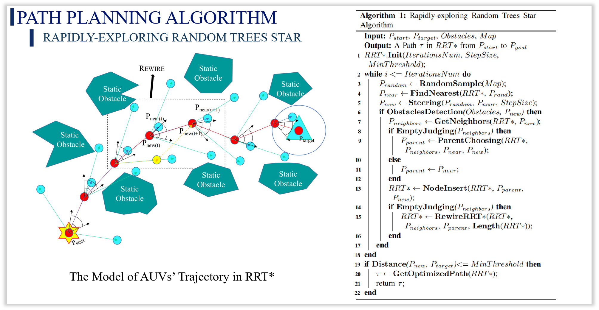

# [Path Planning Algorithm Comparison for Wireless AUVs Energy Sharing System](https://ieeexplore.ieee.org/document/10311674)

## Overview

This project analyzes and compares two path planning algorithms — **RRT\*** and **Particle Swarm Optimization (PSO)** — for a **wireless energy sharing system among Autonomous Underwater Vehicles (AUVs)**. The goal is to enable efficient and collision-free energy transfer routes in complex underwater environments.

## Motivation

AUVs play a critical role in underwater exploration, environmental monitoring, and military operations. However, their limited onboard battery life restricts mission duration. This project proposes a **wireless energy sharing system** where energy-rich AUVs can charge those with depleted batteries via optimized underwater rendezvous paths.

## System Framework

The proposed wireless energy sharing system allows:
- Energy-depleted AUVs to send charging requests.
- Nearby supplier AUVs to respond based on distance, energy availability, and type.
- An algorithm to plan optimal paths for energy delivery while avoiding obstacles.

<table>
  <tr>
    <td></td>
    <td></td>
  </tr>
  <tr>
    <td align="center">Fig. 1: RRT* Path</td>
    <td align="center">Fig. 2: PSO Path</td>
  </tr>
</table>

## Algorithms Compared

### 1. RRT\* (Rapidly-Exploring Random Trees Star)
- Sampling-based algorithm with asymptotic optimality.
- Performs well in obstacle-dense environments.
- Prone to generating non-smooth paths with many small-angle turns.
- Higher computation time due to random exploration.

### 2. PSO (Particle Swarm Optimization)
- Heuristic algorithm inspired by social behavior of swarms.
- Generates smoother paths with faster convergence.
- May not guarantee a globally optimal path.
- Performs better in narrow or irregular obstacle environments.

## Evaluation

Algorithms were tested in two scenarios:
1. **Multi-Random Obstacles**
2. **Specific Irregular Obstacles**

Metrics:
- Path existence
- Path length
- Computational time
- Smoothness

### Key Results

- **RRT\*** has shorter average path lengths but higher variance in time.
- **PSO** offers better real-time performance and smoother paths but may fail to find optimal or feasible paths in some edge cases.
- In complex, narrow environments, PSO performs more robustly.

| Case | RRT* Success | PSO Success | RRT* Length | PSO Length |
|------|--------------|-------------|-------------|-------------|
| 1    | ✅            | ✅           | 67.73       | 56.01       |
| 5    | ✅            | ❌           | 56.52       | -           |
| 6    | ❌            | ❌           | -           | -           |

> See full evaluation in `Section IV` of the paper.

## Future Work

- Incorporate **ocean current dynamics** and **realistic motion constraints**.
- Extend the system to support **multi-AUV cooperation** and **competitive energy sharing**.
- Apply **dynamic or quadratic programming** to improve path curvature and smoothness.
- Introduce **reward/punishment-based optimization models** for cooperative decision-making.

## Citation

If you use this work in your research, please cite:

> Zhengji Feng, Hengxiang Chen, Liqun Chen, Heyan Li, Xiaolin Mou, "Path Planning Algorithm Comparison Analysis for Wireless AUVs Energy Sharing System," 49th Annual Conference of the IEEE Industrial Electronics Society, 2023. DOI: [10.1109/IECON51785.2023.10311674](https://)

